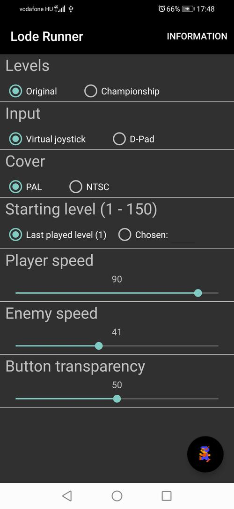
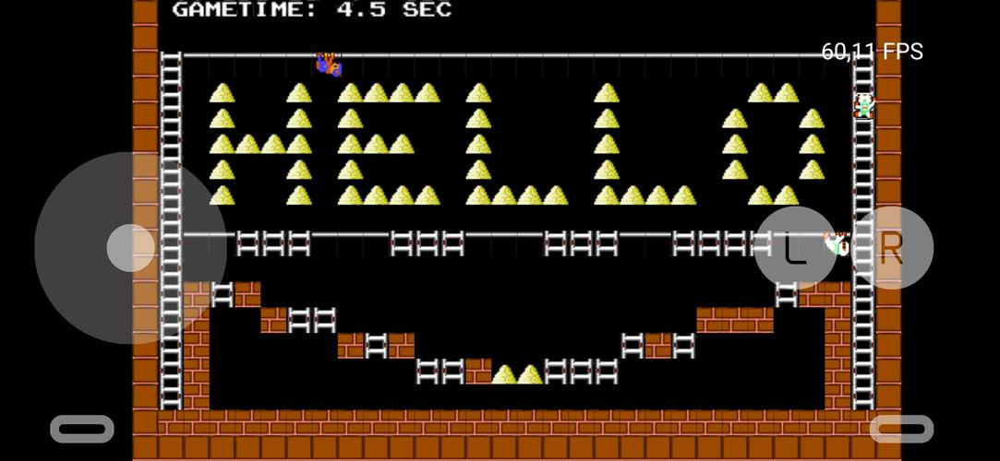

# Lode Runner 2020 - Android Port

This is folder contains the source for the Android port of [Lode Runner 2020](https://github.com/Ma-Pe-Ma/Lode-Runner-2020). 
For generic project-specific informations please checkout the root ReadMe. 
This ReadMe only contains information about the Android port. 

This version was based on the more teapots native activity example, many tools are taken from there.

## Building

1. Clone the repository recursively (to clone the submodules too):

        git clone --recurse-submodules https://github.com/Ma-Pe-Ma/Lode-Runner-2020.git

2. At the [Android/common](https://github.com/Ma-Pe-Ma/Lode-Runner-2020/tree/master/Android/common) folder you can find a *vorbis_working_cmakelists* directory. Copy and paste the content to the vorbis folder (confirm overwriting). 
(These files are needed to build the libvorbis and libvorbisfile libraries properly into the app.)

3. From the [repository root](https://github.com/Ma-Pe-Ma/Lode-Runner-2020), copy the Level, SFX, Textures (but NOT the Shaders!) folders to /Android/LodeRunnerAndroid/src/main/assets directory.

4. Open the Android folder/project with Android Studio. NDK needs to be installed to build the project. Now you should be able to build the project successfully.

## Downloading built version

At the release section you can find the Android version's APK installer too.

You have to enable installing 3rd party softwares in the system settings or a notification will show up.
### Configuring the game ###
- Upon launching the game a configuring activity shows up.
- Here you can set various self-evident gameplay changing variables like in the desktop version. 
- Here you can also set to play the Championship levels too.

- To reset the player/enemy speed values: just simply touch on the proper labels.

### Hardware and Software Requirements ###

Your smartphone has to support OpenGl ES 3.0 and it has to run Lollipop or newer Android (API level >= 21). The target is Android 9.0 - Pie (lvl. 28).

## Screenshots

Config-screen | Gameplay
--- | --- 
 |

## Known bugs

1. Activity handling and switching between apps is messed up, not always working correctly
2. Texture mapping is misplaced somehow (probably the shaders have precision problems).
3. Blending is messed up too

## Future plans

1. Implement controlling by motion sensors.
2. Fix mentioned bugs.
3. Implementing saving last played level (only chosen level number is saved)

**Have fun playing with it!**