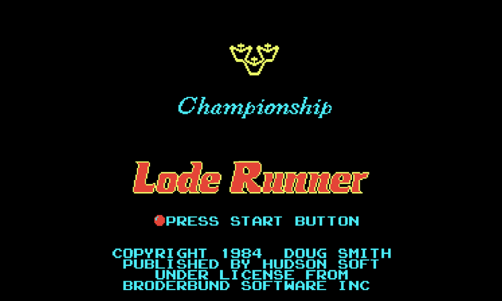
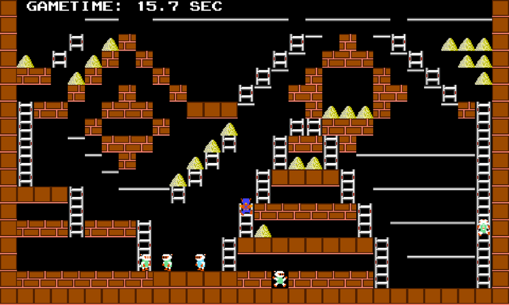
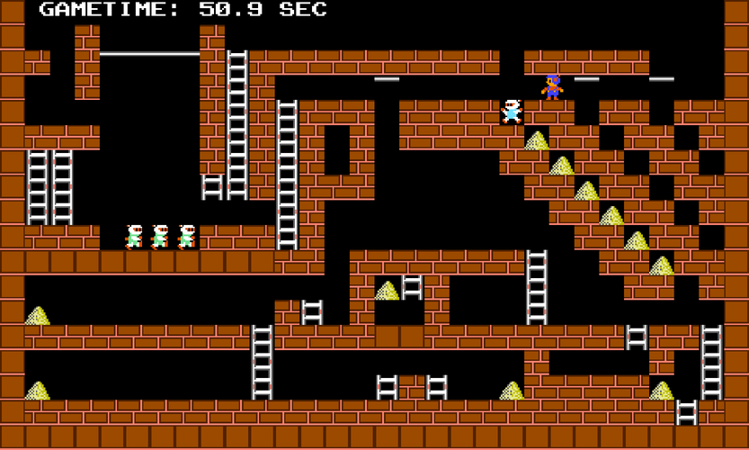

# Lode Runner 2020

 

   

This is a remake of the classic ['80s puzzle video game](https://en.wikipedia.org/wiki/Lode_Runner) (and its hardcore [sequel's](https://en.wikipedia.org/wiki/Championship_Lode_Runner) too)!
The original was developed by [Douglas E. Smith](https://en.wikipedia.org/wiki/Douglas_E._Smith) in 1983 for the [Apple 2](https://en.wikipedia.org/wiki/Apple_II) computer. This version is based on the [NES](https://en.wikipedia.org/wiki/Nintendo_Entertainment_System) port.

Before playing check out the manual of the [original](https://www.gamesdatabase.org/Media/SYSTEM/Nintendo_NES//Manual/formated/Lode_Runner_-_1987_-_Br%C3%B8derbund_Software.pdf) version. I could not find the manual  for the NES port of Championship Lode Runner but [here](https://mocagh.org/broderbund/masksun-loderunner-loderunner-manual.pdf) you can check out the Apple II's manual.

In this ReadMe you can find info about general aspects of the project and about the desktop (Windows/Linux/browser) version. For the details of the Android port please [click here](./Android/ReadMe.md)!

## Browser port

**The game can be played in browser [here](https://mapema.hu/en/hobby/lode-runner/game/)!**

## Gameplay video

## Features of the game
### Differences from the original (NES) version:
- Controller input is supported but the mappings differ from the original 
- The whole level layout can be seen, no scrolling needed
- Original Apple II levelset is used
- Collision detection is not the same as in the original one I implemented a new one 
- Guards' moving are calculated at every frame while in the original one they only moved at every nth (varying) frame
- If the runner falls through a trapdoor it will be marked
- Enemies "wear" different suits when they carry lode
- Level-timer at top of the screen

The levels are ripped from the original Apple II version. The NES port has only 50 levels and this remake includes the missing 100 levels too. Note: The levels ported to the NES are not 100% identical to the original ones, as some rows or columns are missing in the ported levels. If you have the proper NES levelset I will happily include it.

A conspicious difference about the collision detection: in the original when there are 3 guards circling around a ladder, they do not stop, while in this version they do, but this does not effect the gameplay much, I think...

### Extra features:
- Continuing at last played level after startup (ie. auto-saving progress)
- Taking screenshot
- Recording gameplay video

### Missing Features:
- Demo in main menu is not implented :(

### Summarizing what I did not create in this project:
- The textures (I found them on the web they were ripped from the NES cartridge)
- The soundeffects/music (some of them are form online sources but the rest were recorded by me with the help of an emulator)
- Guard AI (the AI is the same as the original it was published in a book which I couldn't get but I found it in an other [remake](https://github.com/SimonHung/LodeRunner) and I translated it back to C++)
- Level design - same as original but copied from the aforementioned remake
- The game logic (obviously...)

Every other feature was developed by me (using existing libraries).

## Compilation help

Clone the project with its submodules:

	git clone --recurse-submodules -j8 https://github.com/Ma-Pe-Ma/Lode-Runner-2020.git

A CMake project is added to the repository which should configure and then build without problems.

The game requires the following dependencies (which do not need further configuring):
- [GLFW](https://www.glfw.org/) - utility used to create OpenGL contexts
- [RTAUDIO](https://www.music.mcgill.ca/~gary/rtaudio/) - used to play sound effects
- [libogg / libvorbis / libvorbisfile](https://xiph.org/downloads/) - used to decode vorbis sound files
- [STBI Image + Write](https://github.com/nothings/stb) - header files used to read textures and write screnshots
- [GLAD](https://glad.dav1d.de/) - an OpenGL Loading Library is a library that loads pointers to OpenGL functions at runtime, this is required to access functions from OpenGL, the source and headers were [generated here](https://glad.dav1d.de/) 
- [this handy shader class](https://learnopengl.com/code_viewer_gh.php?code=includes/learnopengl/shader.h) from [Learn OpenGl](https://learnopengl.com) by Joey De Vries - simple header which handles shaders easily

To use video recording capabilites [FFMPEG](https://ffmpeg.org/) (avformat, avutil, avcodec, swscale, swresample) has to be linked. The process is explained in the CMakeLists (only dowloading and unpacking to the right place are required).

The game should compile without problems to WebAssemby build with Emscripten.

## Controls
The game uses XInput API for controller handling.

	Keyboard    	Controller	    Effect

	arrows		left stick	    moving/change game mode at main menu
	q		LB/LT		    dig to the left
	w		RB/RT		    dig to the right
	esc/enter	start		    pause, skip intro/outro
	space		back		    change level during gameplay (just like in the original)
	
	p		-		    take screenshot
	r		-		    start/end recording gameplay video
	c		-		    show configurer dialog
	
	alt + enter  	-   		    change window mode (full or windowed)

## Downloading and running built versions

Check out the release section you can find simple and video recording versions. Choose the one that you want!

Just simply unpack the 7z archive and launch the "Lode Runner.exe". 

You can also find the [latest builds here](https://github.com/Ma-Pe-Ma/Lode-Runner-2020/actions) which are delivered by Actions.

For the Android notes please check the [aforementioned ReadMe](./Android/ReadMe.md).

### Configuring the game
In the root folder there is a simple txt configuration file in which you can change features of the game.

#### ImGUI Configurer
On the desktop and browser ports a simple imgui configurer dialog is available (which can be shown by pressing the 'C' button).
Here you can specify the same parameters as in the config file but they cannot be saved.

### Championship Lode Runner
To play with this version you just have to set the proper option in the imgui configurer or edit the proper line in the config file.

### Hardware and software requirements
The WASM port should run without problems in modern browsers.

For the desktop version your graphics card has to support OpenGL 4.6 to run it. You also need to install Visual Studio x64 redistributables (vc_redist.x64) from [Microsoft's site](https://aka.ms/vs/16/release/vc_redist.x64.exe).

## Developer Notes
This was my first complex project since I started programming. My earlier efforts were limited to calculating/solving math problems.

This was a good starting project as I learned a lot about programming and designing code while making it.

The project has been restructured numerous times since then and there are only a few parts left which could have been implemented better but cleaning them up may not worth the effort now.

But altogether I'm satisfied with the result.

## Screenshots

### Desktop version

&nbsp;&nbsp;&nbsp;&nbsp;&nbsp;&nbsp;&nbsp;&nbsp;&nbsp;&nbsp;&nbsp;&nbsp;Lode Runner&nbsp;&nbsp;&nbsp;&nbsp;&nbsp;&nbsp;&nbsp;&nbsp;&nbsp;&nbsp;&nbsp;&nbsp; | Championship Lode Runner
--- | ---
 | 
 | 

### Android version

  

## Future tasks for this project:
- Finetune collision detection between enemies
- Finetune browser/wasm mobile touch input
- Improve and polish video recording
- Fix broken Android version (remake this port by using the default cmake project instead of defining a custom one for it)

Backlog:
- Adding some useful extras, eg. score counter, leaderboard, completion time etc.
- Add demo scene

**Have fun playing with it!**
