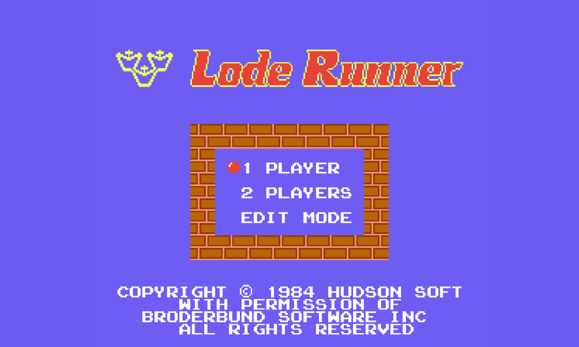

# Lode Runner 2020

 

  

This is a remake of the classic ['80s puzzle video game](https://en.wikipedia.org/wiki/Lode_Runner) (and its hardcore [sequel's](https://en.wikipedia.org/wiki/Championship_Lode_Runner) too)!
The original was developed by [Douglas E. Smith](https://en.wikipedia.org/wiki/Douglas_E._Smith) in 1983 for the [Apple 2](https://en.wikipedia.org/wiki/Apple_II) computer. This version is based on the [NES](https://en.wikipedia.org/wiki/Nintendo_Entertainment_System) port.

Before playing check out the manual of the [original](https://www.gamesdatabase.org/Media/SYSTEM/Nintendo_NES//Manual/formated/Lode_Runner_-_1987_-_Br%C3%B8derbund_Software.pdf) version. I could not find the manual  for the NES port of Championship Lode Runner but [here](https://mocagh.org/broderbund/masksun-loderunner-loderunner-manual.pdf) you can check out the Apple II's manual.

In this ReadMe you can find info about general aspects of the project and about the Windows version. For the details of the Android port please [click here](./Android/ReadMe.md)!

## Gameplay video

## Features of the game
### Differences from the original (NES) version:
- Controller input is supported but the mappings differ from the original 
- The whole level layout can be seen, no scrolling needed
- Original Apple II levelset is used
- Collision detection is not the same as in the original one I implemented a new one 
- Guards' moving are calculated at every frame while in the original one they only moved at every nth (varying) frame
- If the runner falls through a trapdoor it will be marked
- Enemies "wear" different suits when they carry gold
- Level-timer at top of the screen

The levels are ripped from the original Apple II version. The NES port has only 50 levels and this remake includes the missing 100 levels too. Note: The levels ported to the NES are not 100% identical to the original ones, as some rows or columns are missing in the ported levels. If you have the proper NES levelset I will happily include it.

A conspicious difference about the collision detection: in the original when there are 3 guards circling around a ladder, they do not stop, while in this version they do, but this does not effect the gameplay much, I think...

### Extra features:
- Continuing at last played level after startup (ie. auto-saving progress)
- Taking screenshot
- Recording gameplay video

### Missing Features:
- In the NES version after collecting every lode a bonus fruit pickup appears randomly but I could not find the ripped textures so I could not include them
- Demo in main menu is not implented :(

### Summarizing what I did not create in this project:
- The textures (I found them on the web they were ripped from the NES cartridge)
- The soundeffects/music (some of them are form online sources but the rest were recorded by me with the help of an emulator)
- Guard AI (the AI is the same as the original it was published in a book which I couldn't get but I found it in an other [remake](https://github.com/SimonHung/LodeRunner) and I translated it back to C++)
- Level design - same as original but copied from the aforementioned remake
- The game logic (obviously...)

Every other feature was developed by me (using existing libraries).

## Compilation help

Libraries needed to be linked to compile:
- [GLFW](https://www.glfw.org/) - utility used to create OpenGL contexts
- [RTAUDIO](https://www.music.mcgill.ca/~gary/rtaudio/) - used to play sound effects
- [libogg / libvorbis / libvorbisfile](https://xiph.org/downloads/) - used to decode vorbis sound files
- [FFMPEG](https://ffmpeg.org/) (avformat, avutil, avcodec, swscale, swresample) - needed for video recording

Headers needed to be included:
- [STBI Image + Write](https://github.com/nothings/stb) - used to read textures and write screnshots
- [this shader class](https://learnopengl.com/code_viewer_gh.php?code=includes/learnopengl/shader.h) - used to handle shaders easily

Source file needed to be linked:
- [GLAD](https://glad.dav1d.de/) - an OpenGL Loading Library is a library that loads pointers to OpenGL functions at runtime, this is required to access functions from OpenGL

A fully configured Visual Studio project is included in the repository. You have to specify only two paths in the LR_Path.props property sheet to compile it successfully.

At line 5 you have to add the LR_INCLUDE_DIR macro which is the path to the location where the aforementioned libraries' headers + the glad.c source file are located.

Similarly, at line 6 you have specify the LR_LIB_DIR macro which is the path to the location where the libraries' static lib files are located. 
And of course, the libraries' proper dll-s are needed to be put in the built executable's folder.

## Controls:
The game uses XInput API for controller handling.

	Keyboard    	Controller	    Effect

	arrows		left stick	    moving/change game mode at main menu
	q		LB/LT		    dig to the left
	w		RB/RT		    dig to the right
	enter		start		    pause, skip intro/outro
	space		back		    change level during gameplay (just like in the original)
	
	p		-		    take screenshot
	r		-		    start/end recording gameplay video
	
	alt + enter  	-   		    change window mode (full or windowed)

## Downloading and running built versions

Check out the release section you can find simple and video recording versions (with/without a launcher). Choose the one that you want!

Just simply unpack the 7z archive and launch the "Lode Runner.exe". 

For the Android notes please check the [aforementioned ReadMe](./Android/ReadMe.md).

Note: Linux port currently is not available however it is planned.

### Configuring the game
In the root folder there is a simple txt configuration file in which you can change features of the game. Every entry has a description for it.

Moreover you can use the provided launcher ("LR-Launcher.exe") to configure and launch the game in a GUI window. (It just simply recreates the config txt acording to the GUI input).

In the release section the name of file tells you which version contains the launcher.

For the notes regarding the launcher please [click here](./Launcher/ReadMe.md)!

  

### Championship Lode Runner ###
To play with this version you just have to edit the config file/set it in the launcher or launch the exe with "Championship" argument.

### Hardware and software requirements
Your graphics card has to support OpenGL 4.5 to run it. You also need to install Visual Studio x64 redistributables (vc_redist.x64) from [Microsoft's site](https://aka.ms/vs/16/release/vc_redist.x64.exe).

## Developer Notes
This was my first complex project since I started programming. My earlier efforts were limited to calculate/solve math problems.

I tested the game, I completed much of it but much of the code was rewritten so an other deep testing is needed.

This was a good starting project as I learned a lot about programming and designing code.

I know that there are parts that are still badly implemented those parts will be fixed up sporadically as those are not high priorieties for me right now.

## Screenshots

### Desktop version

&nbsp;&nbsp;&nbsp;&nbsp;&nbsp;&nbsp;&nbsp;&nbsp;&nbsp;&nbsp;&nbsp;&nbsp;&nbsp;&nbsp;&nbsp;&nbsp;&nbsp;&nbsp;Lode Runner&nbsp;&nbsp; &nbsp;&nbsp;&nbsp;&nbsp;&nbsp;&nbsp;&nbsp;&nbsp;&nbsp;&nbsp;&nbsp;&nbsp;&nbsp;&nbsp;&nbsp;&nbsp; | Championship Lode Runner
--- | ---
 | 
 | 

### Android version

  

## Future tasks for this project:
- Rewrite code to follow a C++ style guide, cleanup badly written parts
- Further FFMPEG optimization
- Adding some useful extras, eg. score counter, leaderboard, completion time etc.
- Linux port (probably Cmake support?)
- [Dear Imgui](https://github.com/ocornut/imgui) in-game configurer

**Have fun playing with it!**
